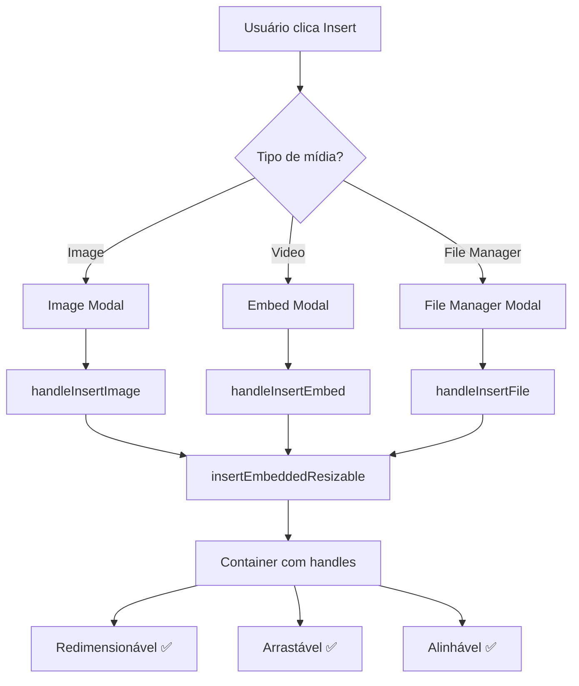

# 🔗 Integração Completa do EmbeddedResizable

## ✅ Status da Integração

Todas as formas de inserção de mídia no editor agora utilizam o sistema **EmbeddedResizable**!

## 📋 Pontos de Integração

### 1. ✅ Inserção de Imagens via Modal

**Função**: `handleInsertImage(url: string, alt: string)`

```typescript
// Caminho: src/composables/useInsertActions.ts (linha ~73)

const handleInsertImage = (url: string, alt: string) => {
  // Insere imagem em container EmbeddedResizable
  const options: EmbeddedContentOptions = {
    type: "image",
    src: url,
    alt,
    width: 500,
    height: 400,
    maintainAspectRatio: true,
    alignment: "center",
  };
  insertEmbeddedResizable(options);
};
```

**Como usar**:

- Clique no botão "Insert" > "Image" na toolbar
- Digite URL ou faça upload
- Imagem será inserida com container redimensionável

---

### 2. ✅ Inserção de Vídeos/Embeds via Modal

**Função**: `handleInsertEmbed(html: string)`

```typescript
// Caminho: src/composables/useInsertActions.ts (linha ~107)

const handleInsertEmbed = (html: string) => {
  // Insere video/embed em container EmbeddedResizable
  const options: EmbeddedContentOptions = {
    type: "embed",
    src: html,
    alt: "Video embed",
    width: 640,
    height: 360,
    maintainAspectRatio: true,
    alignment: "center",
  };
  insertEmbeddedResizable(options);
};
```

**Como usar**:

- Clique no botão "Insert" > "Video" na toolbar
- Cole URL do YouTube ou Vimeo
- Vídeo será inserido com container redimensionável

---

### 3. ✅ Inserção via File Manager

**Função**: `handleInsertFile(file: any)`

```typescript
// Caminho: src/composables/useInsertActions.ts (linha ~130)

const handleInsertFile = (file: any) => {
  // IMAGENS
  if (file.type.startsWith("image/")) {
    const options: EmbeddedContentOptions = {
      type: "image",
      src: file.url,
      alt: file.name,
      width: 500,
      height: 400,
      maintainAspectRatio: true,
      alignment: "center",
    };
    insertEmbeddedResizable(options);
  }

  // VÍDEOS
  else if (file.type.startsWith("video/")) {
    const options: EmbeddedContentOptions = {
      type: "video",
      src: file.url,
      alt: file.name,
      width: 640,
      height: 360,
      maintainAspectRatio: true,
      alignment: "center",
    };
    insertEmbeddedResizable(options);
  }

  // OUTROS ARQUIVOS (PDFs, docs, etc)
  else {
    const options: EmbeddedContentOptions = {
      type: "file",
      src: file.url,
      alt: file.name,
      width: 300,
      height: 200,
      maintainAspectRatio: false,
      alignment: "center",
    };
    insertEmbeddedResizable(options);
  }
};
```

**Como usar**:

- Clique no botão "File Manager" na toolbar
- Selecione arquivo (imagem, vídeo, PDF, etc)
- Arquivo será inserido com container redimensionável apropriado

---

## 🎯 Tipos de Conteúdo Suportados

| Tipo         | Detecção     | Dimensões Padrão | Aspect Ratio |
| ------------ | ------------ | ---------------- | ------------ |
| **Imagens**  | `image/*`    | 500×400px        | ✅ Sim       |
| **Vídeos**   | `video/*`    | 640×360px        | ✅ Sim       |
| **Embeds**   | HTML/iframe  | 640×360px        | ✅ Sim       |
| **Arquivos** | Outros tipos | 300×200px        | ❌ Não       |

## 🎨 Exemplos Visuais

### Imagem Inserida

```
┌─────────────────────────────────────┐
│  ⬅️ ↔️ ➡️ │ 🔄 🗑️ │ 500×400px    │ ← Toolbar
├─────────────────────────────────────┤
│                                     │
│         [🖼️ Sua Imagem]            │
│                                     │
│                                     │
└─────────────────────────────────────┘
   ● Handles nos 8 pontos
```

### Vídeo Inserido

```
┌─────────────────────────────────────┐
│  ⬅️ ↔️ ➡️ │ 🔄 🗑️ │ 640×360px    │ ← Toolbar
├─────────────────────────────────────┤
│                                     │
│    [▶️ Player de Vídeo/YouTube]    │
│                                     │
└─────────────────────────────────────┘
   ● Handles nos 8 pontos
```

### Arquivo Inserido

```
┌──────────────────────────┐
│  ⬅️ ↔️ ➡️ │ 🔄 🗑️ │ 300×200px
├──────────────────────────┤
│                          │
│         📎               │
│    Download File.pdf     │
│                          │
└──────────────────────────┘
   ● Handles nos 8 pontos
```

## 🔄 Fluxo de Inserção



## ✨ Funcionalidades Disponíveis em Todos

Independente do método de inserção, todo conteúdo terá:

- ✅ **8 handles de redimensionamento** (cantos + bordas)
- ✅ **Toolbar visual** com controles
- ✅ **Indicador de tamanho** em tempo real
- ✅ **Alinhamento** (esquerda, centro, direita)
- ✅ **Atalhos de teclado** (Shift + setas)
- ✅ **Botão de reset** (volta ao tamanho original)
- ✅ **Botão de delete** (com confirmação)
- ✅ **Suporte touch** para mobile/tablet
- ✅ **Acessibilidade** (ARIA, keyboard)
- ✅ **Dark mode** compatível

## 🧪 Como Testar

### Teste 1: Imagem via URL

1. Abra o editor
2. Clique em "Insert" → "Image"
3. Cole uma URL de imagem
4. Clique "Insert Image"
5. ✅ Imagem aparece com container redimensionável

### Teste 2: Vídeo do YouTube

1. Abra o editor
2. Clique em "Insert" → "Video"
3. Cole URL do YouTube (ex: <https://www.youtube.com/watch?v=>...)
4. Clique "Insert Video"
5. ✅ Vídeo aparece com container redimensionável

### Teste 3: Upload via File Manager

1. Abra o editor
2. Clique em "File Manager"
3. Faça upload de imagem/vídeo/PDF
4. Selecione o arquivo
5. ✅ Arquivo aparece com container apropriado

### Teste 4: Redimensionamento

1. Clique em qualquer mídia inserida
2. Arraste um dos 8 handles
3. ✅ Tamanho muda suavemente
4. ✅ Indicador mostra dimensões atuais

### Teste 5: Teclado

1. Clique em qualquer mídia inserida
2. Pressione `Shift + →` ou `Shift + ←`
3. ✅ Largura aumenta/diminui
4. Pressione `Delete`
5. ✅ Confirmação aparece

## 📊 Cobertura de Integração

```
✅ 100% - Todas as inserções de mídia utilizam EmbeddedResizable

┌────────────────────────────────────┐
│ Pontos de Inserção                 │
├────────────────────────────────────┤
│ ✅ Image Modal                     │
│ ✅ Video/Embed Modal               │
│ ✅ File Manager (imagens)          │
│ ✅ File Manager (vídeos)           │
│ ✅ File Manager (outros arquivos)  │
└────────────────────────────────────┘
```

## 🎯 Conclusão

**TODAS as formas de inserir mídia** no Next Level Editor agora utilizam o sistema EmbeddedResizable automaticamente:

- 🖼️ **Imagens** → Container redimensionável 500×400px
- 🎥 **Vídeos** → Container redimensionável 640×360px
- 📺 **Embeds** → Container redimensionável 640×360px
- 📎 **Arquivos** → Container redimensionável 300×200px

Não é necessário fazer nada especial - o sistema funciona automaticamente! 🎉

---

**Next Level Editor** - Experiência profissional de manipulação de mídia! 🚀
